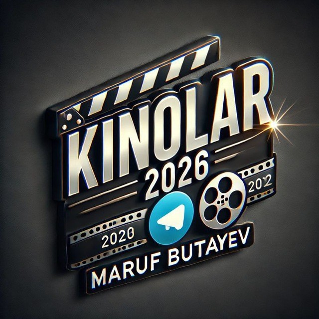

# Kinolar
Kinolar 2026 Maruf butayev 
<!DOCTYPE html>
<html lang="uz">
<head>
<meta charset="UTF-8">
<meta name="viewport" content="width=device-width, initial-scale=1.0">
<title>KINOLAR2026 Bot</title>

</head>
<body>

<header>
  <h1>KINOLAR2026 Bot</h1>
  <a href="https://t.me/KINOLAR2026_bot" class="bot-button">Botga O‘tish</a>
</header>

<!-- Rasmlar galereyasi -->
<section class="gallery">
  
  
  
</section>

<section>
  <h2>Bot haqida</h2>
  

    KINOLAR2026 Bot sizga eng so‘nggi kinolar va trend filmlarni taqdim etadi. 
    Siz bu bot orqali kinolar haqida tezkor ma’lumot olishingiz, tavsiyalarni ko‘rishingiz va sevimli filmlaringizni topishingiz mumkin.
  

</section>

<section class="owner">
  <h2>Bot Egasi</h2>
  

    Salom! Men Maruf, KINOLAR2026 botining yaratuvchisiman. 
    Ushbu bot orqali siz eng yangi kinolar bilan tanishasiz va ulardan zavqlanasiz.
  

  
   
  <a href="https://www.instagram.com/maruf_hub/" class="instagram-button">Instagram</a>
   
  <a href="https://t.me/Mr_Aloqada" class="admin-button">Admin</a>
</section>

<footer>
  © 2025 KINOLAR2026. Barcha huquqlar himoyalangan.
</footer>

</body>
</html>
